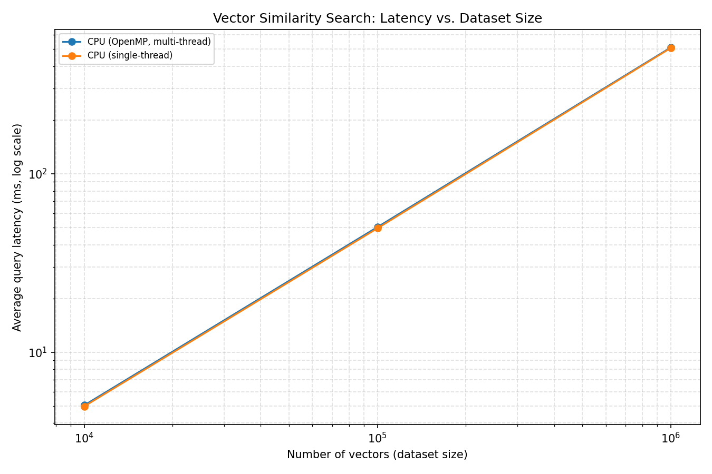
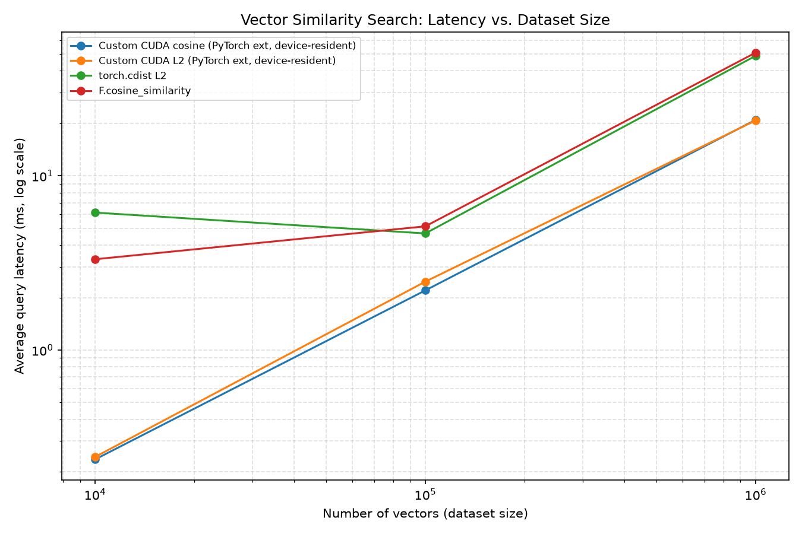

# CUDA-Accelerated Vector Similarity Search Engine

A from-scratch C++/CUDA implementation of brute-force vector similarity
search (L2 distance and cosine similarity), built as a GPU-accelerated
counterpart to the CPU-based FAISS retrieval path used in my
[Financial Market Intelligence RAG System]. Benchmarked against
single-threaded CPU, multi-threaded CPU (OpenMP), and FAISS itself across
dataset sizes from 10K to 1M vectors.

This is not a production vector database. It's a focused engineering
exercise in GPU performance optimization: start with a correct-but-naive
CUDA kernel, profile it, find the actual bottleneck, fix that specific
bottleneck with shared memory, and measure the difference honestly.

## Why this project exists

My existing RAG project uses FAISS's CPU implementation for vector
retrieval. This project answers a narrower question: what does it take to
move that same brute-force search onto a GPU by hand, and where does the
performance actually come from? The goal is depth on one well-understood
optimization (shared memory tiling to eliminate redundant global memory
reads), not breadth across every possible GPU trick.

## Architecture

```
include/
  vector_store.hpp     -- contiguous row-major vector storage
  distance_cpu.hpp      -- CPU L2 / cosine, single-thread + OpenMP
  distance_cuda.cuh      -- host-side wrapper declarations for the CUDA kernels
  cuda_timing.cuh        -- shared kernel-timing accessor (see note below)
  topk_cpu.hpp            -- CPU top-k (std::partial_sort) -- also the
                             correctness ground truth for GPU top-k
src/
  cpu/distance_cpu.cpp    -- L2 / cosine implementation
  cpu/topk_cpu.cpp
  cuda/distance_naive.cu  -- one-thread-per-candidate, no memory optimization
  cuda/distance_tiled.cu  -- shared-memory-tiled optimization (see below)
  cuda/topk_cuda.cu       -- optional: GPU top-k via Thrust
  cuda/cuda_timing.cu     -- shared timing state (see "why a separate file" below)
  benchmark/bench_runner.cpp -- times every available implementation, writes CSV
  benchmark/data_gen.hpp  -- raw float32 dump/load, compatible with numpy .tofile()
tests/
  test_correctness.cpp    -- CPU correctness tests (see "What's verified" below)
  test_correctness_gpu.cpp -- GPU kernels vs. CPU ground truth (only builds with CUDA)
scripts/
  plot_results.py         -- latency-vs-size chart from the CSV
  faiss_baseline.py        -- FAISS CPU baseline, appends to the same CSV
results/
  benchmark.csv            -- accumulates every run (git-ignore if you don't want history)
  latency_chart.png         -- generated by plot_results.py
pytorch_ext/
  (see pytorch_ext/README.md) -- custom PyTorch CUDA extension wrapping
                                 the tiled kernel as a native torch op,
                                 benchmarked against torch.cdist /
                                 F.cosine_similarity
```

**Why `cuda_timing.cu` is a separate file:** both `distance_naive.cu` and
`distance_tiled.cu` need to report the elapsed kernel time back through the
same `last_kernel_time_ms()` function declared in `distance_cuda.cuh`. If
each `.cu` file defined that function itself, you'd get a duplicate-symbol
link error the moment both object files are linked together. Pulling the
shared timing state into its own translation unit is the standard fix.

## What's verified vs. what needs a GPU to verify

**Verified on CPU (any machine):** the entire CPU path
(`vector_store.hpp`, `distance_cpu.cpp`, `topk_cpu.cpp`) --
`tests/test_correctness.cpp` covers known L2/cosine values,
single-thread-vs-OpenMP agreement, and top-k correctness.

**Verified on Google Colab NVIDIA Tesla T4 (15 GB; nvcc 12.8):**
`tests/test_correctness_gpu.cpp` passed (naive & tiled kernels vs. CPU
ground truth, tolerance 1e-4, including non-block-aligned sizes).
`bench_runner` numbers below are from that same T4 class of run.
The PyTorch extension path is also verified -- see `pytorch_ext/README.md`
and the Results subsection below.

## Building

### CPU-only (no GPU required)

```bash
g++ -std=c++17 -O2 -fopenmp -I include -I src/benchmark \
    src/benchmark/bench_runner.cpp src/cpu/distance_cpu.cpp src/cpu/topk_cpu.cpp \
    -o bench_runner
./bench_runner            # sweeps 10K / 100K / 1M vectors, dim=384
```

```bash
g++ -std=c++17 -O2 -fopenmp -I include \
    tests/test_correctness.cpp src/cpu/distance_cpu.cpp src/cpu/topk_cpu.cpp \
    -o test_correctness
./test_correctness
```

### Full build with CUDA (requires CUDA toolkit + NVIDIA GPU)

```bash
mkdir build && cd build
cmake ..        # auto-detects nvcc; falls back to CPU-only with a warning if absent
make -j
./test_correctness_gpu    # RUN THIS FIRST -- verifies naive & tiled kernels against CPU ground truth
./test_correctness
./bench_runner
```

`CMakeLists.txt` uses `check_language(CUDA)` so the same file builds either
configuration without edits -- useful if you're developing on a laptop
without a GPU and only testing the CUDA path on a cloud instance or lab
machine. `test_correctness_gpu` (in `tests/test_correctness_gpu.cpp`) is
only built when CUDA is detected; it compares `batch_distance_naive_cuda`
and `batch_distance_tiled_cuda` output against the CPU single-threaded
ground truth (tolerance 1e-4) across several dataset sizes, including
sizes smaller than one thread block and sizes that aren't clean multiples
of the block size -- those boundary cases are the most likely place for an
off-by-one bug in the `i >= num_vectors` guard or the shared-memory
cooperative load loop to show up. It also cross-checks the two GPU kernels
against each other, which catches bugs that happen to cancel out against
CPU floating-point rounding for a particular random seed. **Don't trust any
`bench_runner` latency number until this passes.**

### Plotting results

```bash
pip install pandas matplotlib
python3 scripts/plot_results.py
```

### FAISS baseline (optional, for the "industry benchmark" comparison line)

```bash
pip install faiss-cpu numpy
python3 scripts/faiss_baseline.py
```

## Technical decisions log

**Row-major contiguous storage, not `vector<vector<float>>`.** A flat
buffer is cache-friendlier on CPU and is a prerequisite for a single
`cudaMemcpy` transfer to the GPU (vs. N separate transfers or an array of
device pointers). This is the same layout FAISS and cuBLAS use internally.

**Naive kernel: one thread per candidate vector.** The simplest possible
mapping, and useful precisely because it's easy to reason about as a
baseline -- every thread does a full serial distance computation, with no
attempt at memory optimization.

**Shared memory tiling targets the redundant query read, not candidate
reads.** In the naive kernel, all `threads_per_block` threads in a block
independently re-read the same `dim`-length query vector from global
memory -- that's `threads_per_block`x more query-vector traffic than
necessary. The tiled kernel loads the query vector into `__shared__` memory
once per block (cooperative load + `__syncthreads()`), then every thread
reads from shared memory instead. This was chosen as the first optimization
because it's the single largest source of redundant traffic in this access
pattern -- see "Future work" for the next optimization (candidate tiling)
if you want to push further.

**Dynamic shared memory sizing (`extern __shared__`), not a fixed-size
array.** `dim` is a runtime parameter, not a compile-time constant, so
shared memory is sized via the kernel launch's third `<<<>>>` parameter
rather than hardcoding `__shared__ float buf[384]`.

**Wall-clock AND kernel-only timing, reported separately.** Every CUDA
benchmark call reports both the full wall-clock time (including
`cudaMemcpy` host<->device transfer) and the isolated kernel execution time
(via `cudaEvent`). This benchmark intentionally re-transfers data on every
query rather than keeping it resident on the device across queries --
that's unrealistic for a real retrieval service (you'd upload the index
once and query it many times), but it makes the transfer-vs-compute ratio
visible in the results, which is itself a useful finding to report. See
"Known limitations" below.

**GPU top-k via Thrust, not a hand-written selection kernel.** Thrust ships
with the CUDA toolkit and is the standard choice for sort/reduce
primitives on GPU. Writing a bitonic top-k selection kernel from scratch is
a legitimate deeper project, but a separate one -- using Thrust here is an
engineering trade-off I'm naming explicitly, not hiding.

## Known limitations (worth stating in an interview, not something to
paper over)

- **Per-query re-transfer.** Every benchmark call re-uploads the full
  dataset to the GPU. A real retrieval service would upload the corpus once
  and serve many queries against device-resident data -- that's the
  natural "next" optimization and would make the GPU numbers look
  considerably better, since the wall-clock numbers here are dominated by
  transfer for small/medium dataset sizes.
- **Only the query vector is tiled into shared memory; candidate vectors
  are not.** A further optimization (analogous to full tiled GEMM) would
  block the candidate vectors into shared memory too, reducing global
  memory traffic further. Not done here to keep the optimization story
  focused on one clear, explainable win.
- **Brute-force exact search only.** No approximate nearest-neighbor
  structure (IVF, HNSW, product quantization, etc.) -- this project is
  about the low-level performance of the distance computation itself, not
  about building a competitive ANN index. FAISS's own IVF/HNSW indexes
  would beat all of this for large-scale approximate retrieval; the
  brute-force FAISS `IndexFlatL2` is the fair, apples-to-apples comparison
  point used here.
- **Single-GPU, single-query-at-a-time.** No batched multi-query kernel,
  no multi-GPU. Batching multiple queries into one kernel launch is a
  natural throughput optimization if you extend this further.

## Future work

- Candidate-vector tiling (the "full GEMM-style" version of the shared
  memory optimization).
- Batch multiple queries per kernel launch instead of one query at a time.
- Profile with `nsight compute` / `nvprof` and report actual memory
  throughput and occupancy numbers, not just wall-clock speedup.
- Keep the dataset resident on the device across queries (build the index
  once, query many times) to get a realistic serving-latency number.
  **Update: this is now addressed by `pytorch_ext/`**, which wraps the
  tiled kernel as a PyTorch extension operating on device-resident
  tensors -- see `pytorch_ext/README.md`.
- Hand-written bitonic top-k kernel as an alternative to the Thrust-based
  approach.
- Wire `pytorch_ext/demo_rerank.py` up to a real sentence-embedding model
  (e.g. sentence-transformers) instead of random stand-in vectors, to make
  the reranking demo end-to-end realistic.

## Results

**Hardware:** Google Colab **NVIDIA Tesla T4** (15 GB VRAM), driver reporting
CUDA 13.0, project built with **nvcc CUDA toolkit 12.8**.
**Workload:** `dim=384`, L2 distance unless noted.
Main-table numbers are from a re-run averaged over **50 queries** per size
(earlier 10-query runs showed Colab CPU OpenMP jitter at 100K).
GPU columns below are **kernel-only** times (exclude host↔device transfer).
Wall-clock numbers (with per-query re-upload) are in `results/benchmark.csv`
and on the chart -- at 100K–1M they are dominated by transfer, as noted under
Known limitations. FAISS CPU is from the same Colab T4 machine (separate script).

| Dataset size | CPU single-thread | CPU OpenMP | GPU naive (kernel) | GPU tiled (kernel) | FAISS CPU |
|---|---|---|---|---|---|
| 10,000    | 4.85 ms | 2.57 ms | 0.28 ms | 0.18 ms | 4.30 ms |
| 100,000   | 50.8 ms | 37.0 ms | 2.68 ms | 2.78 ms | 45.0 ms |
| 1,000,000 | 486 ms | 286 ms | 28.3 ms | 28.4 ms | 416 ms |

Speedup, tiled vs. naive GPU (kernel, 10K): **1.6×**
Speedup, tiled GPU vs. multi-threaded CPU (kernel, 100K): **13×**
Speedup, tiled GPU vs. multi-threaded CPU (kernel, 1M): **10×**

At 100K–1M the tiled and naive kernels are essentially tied (~2.7 ms / ~28 ms):
the shared-memory query tiling win is clearest at smaller sizes; at large `n`
other costs dominate the kernel path. GPU wall-clock at 1M (~391–393 ms) is
close to FAISS CPU / OpenMP because this benchmark re-transfers the full
dataset every query.



### PyTorch extension (device-resident tensors)

Same T4, custom tiled kernel wrapped as a PyTorch CUDA extension vs.
`torch.cdist` / `F.cosine_similarity`. Timed with `torch.cuda.Event` on
already-GPU-resident tensors (no host↔device transfer in the timed path).
Raw numbers: `results/benchmark_torch.csv`.

| Dataset size | custom L2 | `torch.cdist` L2 | custom cosine | `F.cosine_similarity` |
|---|---|---|---|---|
| 10,000    | 0.24 ms | 6.15 ms | 0.24 ms | 3.32 ms |
| 100,000   | 2.47 ms | 4.67 ms | 2.20 ms | 5.13 ms |
| 1,000,000 | 20.8 ms | 48.8 ms | 20.9 ms | 50.9 ms |

On this T4 run the custom kernel was faster than the built-in ops at every
size tested (about **1.9×** vs `torch.cdist` at 100K, **2.4×** at 1M). That
is a useful data point for this narrow brute-force distance pattern; it is
not a claim that hand-written kernels beat PyTorch in general.


