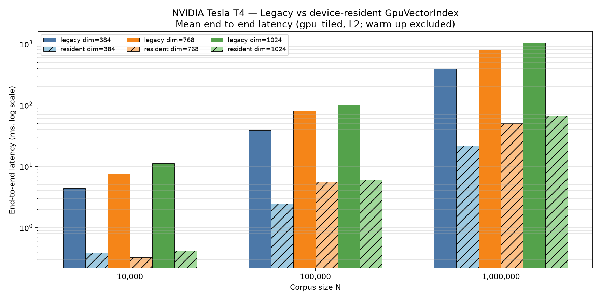
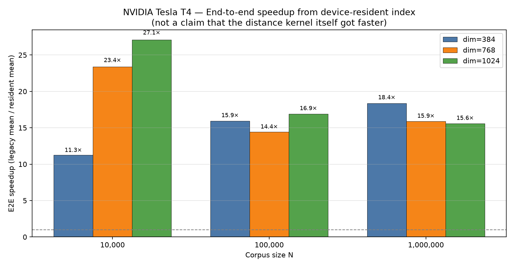
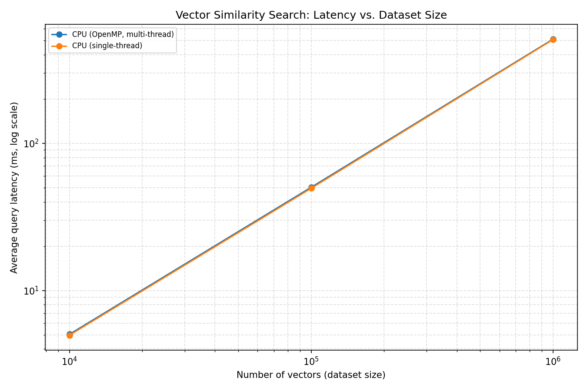
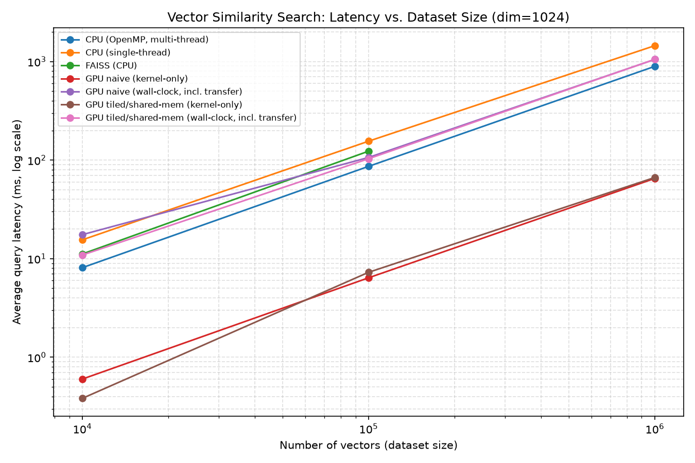
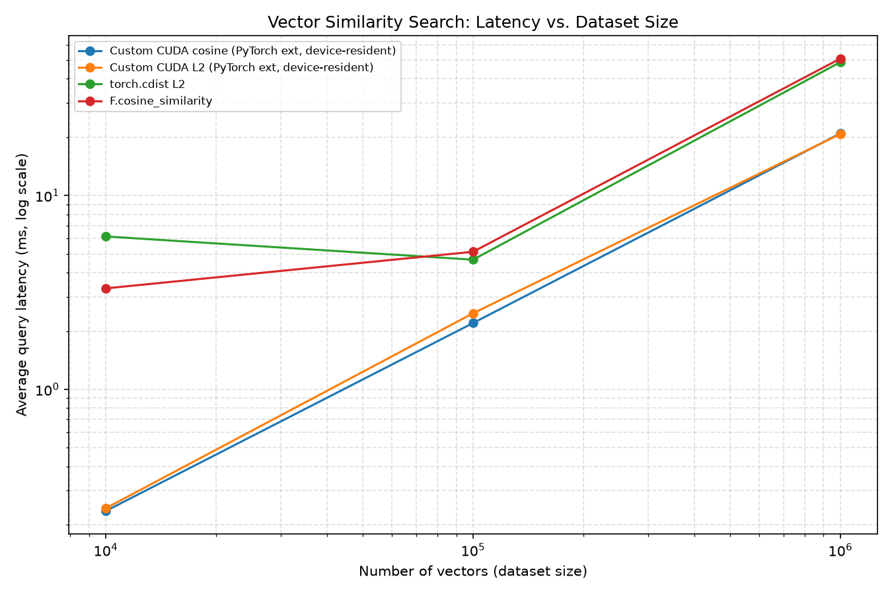

<div align="center">

# CUDA Vector Similarity Search

From-scratch C++/CUDA brute-force vector search (L2 & cosine) — a GPU counterpart to CPU FAISS retrieval.

[](https://isocpp.org/)
[](https://developer.nvidia.com/cuda-zone)
[](https://pytorch.org/)
[](https://github.com/facebookresearch/faiss)
[](#results)

**Personal project** by [@amberfxy](https://github.com/amberfxy) (**Amber Fan**)  
Companion to the [Financial Market Intelligence RAG](https://github.com/amberfxy/financial-market-intelligence-rag) retrieval path

</div>

---

Focused GPU engineering: measurement-driven exact L2/cosine search as a
**reusable CUDA library** (resident index, warp-per-vector kernel, PyTorch
extension) — not a distributed vector database.

**T4 highlights (measured; separate controlled experiments — do not multiply):**

| Phase | What changed | 1M × 384 L2 result |
|---|---|---|
| **4 — residency** | Eliminate repeated corpus H2D/alloc | E2E **396.7 → 21.6 ms (~18.4×)**, QPS **2.5 → 46.3** ([`phase1_benchmark.csv`](results/phase1_benchmark.csv)) |
| **5A — warp mapping** | One warp / candidate; contiguous dim loads | Kernel **20.898 → 5.823 ms (~3.59×)**, E2E **21.881 → 6.867 ms (~3.19×)**, QPS **45.7 → 145.6** ([`PHASE5_WARP_PER_VECTOR.md`](docs/PHASE5_WARP_PER_VECTOR.md)) |

Production-oriented docs: [`docs/production-readiness.md`](docs/production-readiness.md) ·
[`docs/architecture.md`](docs/architecture.md) ·
[`docs/benchmark-methodology.md`](docs/benchmark-methodology.md) ·
[`docs/performance-analysis.md`](docs/performance-analysis.md) ·
[`docs/pytorch-integration.md`](docs/pytorch-integration.md).

## Why this project exists

The companion RAG system retrieves with **FAISS on CPU** (`IndexFlatL2`). This repo asks a narrower question: what does it take to move that same class of brute-force distance search onto a GPU by hand, and where do measured speedups actually come from? Depth on one clear optimization (shared-memory tiling to cut redundant **query** global reads), not every GPU trick.

## Architecture

```
include/
  vector_store.hpp     -- contiguous row-major vector storage
  distance_cpu.hpp      -- CPU L2 / cosine, single-thread + OpenMP
  distance_cuda.cuh      -- host-side wrapper declarations for the CUDA kernels
  gpu_vector_index.cuh   -- device-resident GpuVectorIndex + staged timing API
  bench_stats.hpp        -- mean / p50 / p95 / p99 helpers (Phase 1 harness)
  cuda_timing.cuh        -- shared kernel-timing accessor (see note below)
  topk_cpu.hpp            -- CPU top-k (std::partial_sort) -- also the
                             correctness ground truth for GPU top-k
src/
  cpu/distance_cpu.cpp    -- L2 / cosine implementation
  cpu/topk_cpu.cpp
  cuda/distance_naive.cu  -- one-thread-per-candidate, no memory optimization
  cuda/distance_tiled.cu  -- shared-memory-tiled optimization (see below)
  cuda/distance_warp.cu   -- Phase 5A: warp-per-vector L2 (--method warp; not default)
  cuda/gpu_vector_index.cu -- upload corpus once; reuse buffers across searches
  cuda/topk_cuda.cu       -- optional: GPU top-k via Thrust
  cuda/cuda_timing.cu     -- shared timing state (see "why a separate file" below)
  benchmark/bench_runner.cpp -- original mean-latency sweep → results/benchmark.csv
  benchmark/bench_harness.cpp -- Phase 1/4/5: stage timings + legacy vs resident
  benchmark/profile_kernel.cpp -- focused resident workload for Nsight
  benchmark/data_gen.hpp  -- raw float32 dump/load, compatible with numpy .tofile()
tests/
  test_correctness.cpp    -- CPU correctness tests (see "What's verified" below)
  test_correctness_gpu.cpp -- GPU kernels + GpuVectorIndex vs CPU (CUDA)
  test_bench_stats.cpp    -- percentile helper unit test (CPU)
scripts/
  plot_results.py         -- historical baseline latency chart
  plot_phase4_results.py  -- legacy vs resident charts from phase1 CSV
  faiss_baseline.py        -- FAISS CPU baseline, appends to the same CSV
  run_phase1_benchmark.sh  -- reproducible legacy vs resident matrix
  run_phase5a_ab.sh        -- focused resident tiled vs warp A/B (1M×384 L2)
docs/
  BASELINE_ARCHITECTURE.md -- execution paths, measured vs suspected bottlenecks
  KERNEL_AUDIT.md          -- measured facts vs hypotheses (pre-Nsight)
  OPTIMIZATION_CANDIDATES.md -- warp/block-per-vector candidates
  PHASE5_WARP_PER_VECTOR.md -- Phase 5A warp-per-vector (measured T4 A/B + Nsight)
  NSIGHT_PROFILING.md      -- Colab/T4 ncu workflow for resident kernel
results/
  phase1_benchmark.csv     -- T4 legacy vs resident stage timings (Phase 4 source of truth)
  phase1_json/             -- per-config JSON from the same T4 run
  PHASE5_RUN_NOTE.md       -- Phase 5A measured summary + Colab artifact checklist
  phase4_*.png             -- charts generated from phase1_benchmark.csv
  benchmark.csv            -- historical Colab T4 mean-latency baseline
  schema_phase1.md         -- Phase 1/4 harness column definitions
  latency_chart.png         -- historical baseline chart (preserved)
pytorch_ext/
  (see pytorch_ext/README.md) -- custom PyTorch CUDA extension wrapping
                                 the tiled kernel as a native torch op,
                                 benchmarked against torch.cdist /
                                 F.cosine_similarity
```

**Why `cuda_timing.cu` is a separate file:** both `distance_naive.cu` and
`distance_tiled.cu` need to report the elapsed kernel time back through the
same `last_kernel_time_ms()` function declared in `distance_cuda.cuh`. If
each `.cu` file defined that function itself, you'd get a duplicate-symbol
link error the moment both object files are linked together. Pulling the
shared timing state into its own translation unit is the standard fix.

## What's verified vs. what needs a GPU to verify

**Verified on CPU (any machine):** the entire CPU path
(`vector_store.hpp`, `distance_cpu.cpp`, `topk_cpu.cpp`) --
`tests/test_correctness.cpp` covers known L2/cosine values,
single-thread-vs-OpenMP agreement, and top-k correctness.

**Verified on Google Colab NVIDIA Tesla T4 (15 GB; nvcc 12.8):**
`tests/test_correctness_gpu.cpp` passed for dims `{384,768,1024}`, L2 + cosine,
legacy tiled / resident tiled / resident naive vs CPU (absolute tol **1e-4**),
plus zero-query cosine, repeated resident-search stability, GPU memory
reclamation, and 1M×384 L2 validation. Phase 1/4 harness numbers are in
`results/phase1_benchmark.csv`. Phase 5A warp-per-vector L2 A/B + Nsight are
documented in [`docs/PHASE5_WARP_PER_VECTOR.md`](docs/PHASE5_WARP_PER_VECTOR.md)
(CSV/JSON still to copy from Colab — see `results/PHASE5_RUN_NOTE.md`).
Historical `bench_runner` / PyTorch tables remain under
[Historical baseline results](#historical-baseline-results).

## Library API (resident index)

```cpp
#include "gpu_vector_index.cuh"

auto idx = GpuVectorIndex::build(h_store, N, dim /*, device=*/);
std::vector<float> scores(N);
idx.search(h_query, Metric::L2, scores.data(), GpuKernelKind::Warp);

std::vector<float> batch_scores(Q * N);
idx.search_batch(h_queries, Q, Metric::L2, batch_scores.data(), GpuKernelKind::Tiled);

auto st = idx.stats();   // device name, bytes, capacities
idx.reset();             // free GPU memory
```

`add()` is not supported (immutable corpus). Rebuild to change data.
Errors (OOM, bad device, NaN query, unsupported warp+cosine) throw with diagnostics.

### Build / test / regress

```bash
cmake -B build -DCMAKE_BUILD_TYPE=Release
cmake --build build -j
ctest --test-dir build --output-on-failure          # CPU always; GPU if present
./build/test_correctness_matrix                     # GPU correctness matrix
./scripts/run_regression_suite.sh                   # machine-local CSV (does not overwrite Phase 4)
./build/bench_batch --num-vectors 100000 --dim 384 --batch 32 --method warp
```

Supported toolchains: C++17, CMake ≥3.18, CUDA architectures `70;75;80;86` by default
(Volta–Ampere). Document your `nvcc --version` with any new CSV.


```bash
g++ -std=c++17 -O2 -fopenmp -I include -I src/benchmark \
    src/benchmark/bench_runner.cpp src/cpu/distance_cpu.cpp src/cpu/topk_cpu.cpp \
    -o bench_runner
./bench_runner            # sweeps 10K / 100K / 1M vectors, dim=384
```

```bash
g++ -std=c++17 -O2 -fopenmp -I include \
    tests/test_correctness.cpp src/cpu/distance_cpu.cpp src/cpu/topk_cpu.cpp \
    -o test_correctness
./test_correctness
```

### Full build with CUDA (requires CUDA toolkit + NVIDIA GPU)

```bash
cmake -B build -DCMAKE_BUILD_TYPE=Release
cmake --build build -j
./build/test_correctness          # CPU path
./build/test_bench_stats          # Phase 1 percentile helper
./build/test_correctness_gpu      # RUN FIRST on GPU — legacy + GpuVectorIndex vs CPU
./build/bench_runner              # original mean-latency sweep
./build/bench_harness --help      # Phase 1/4 stage timings + legacy vs resident
./build/profile_kernel --help     # focused resident workload for Nsight Compute
```

Kernel profiling (after residency, T4): see [`docs/NSIGHT_PROFILING.md`](docs/NSIGHT_PROFILING.md).
Do **not** rewrite kernels until an Nsight report exists — audit/candidates in
[`docs/KERNEL_AUDIT.md`](docs/KERNEL_AUDIT.md) and
[`docs/OPTIMIZATION_CANDIDATES.md`](docs/OPTIMIZATION_CANDIDATES.md).

`CMakeLists.txt` uses `check_language(CUDA)` so the same file builds either
configuration without edits -- useful if you're developing on a laptop
without a GPU and only testing the CUDA path on a cloud instance or lab
machine. `test_correctness_gpu` compares naive/tiled/legacy/resident paths
against CPU ground truth (absolute tolerance **1e-4**) across sizes and dims
`{384,768,1024}`, including non-block-aligned `n=257`, zero-query cosine,
repeated resident searches, and a best-effort memory-stability check.
**Don't trust any harness latency number until this passes.**

### Phase 1 / Phase 4: legacy vs device-resident harness

Baseline architecture notes: [`docs/BASELINE_ARCHITECTURE.md`](docs/BASELINE_ARCHITECTURE.md).  
Output schema: [`results/schema_phase1.md`](results/schema_phase1.md).

```bash
# Single config (requires GPU)
./build/bench_harness --num-vectors 100000 --dim 384 --warmup 5 --iterations 50 \
  --metric l2 --mode both --method tiled \
  --csv results/phase1_benchmark.csv --json results/phase1_smoke.json

# Full matrix (10K/100K/1M × 384/768/1024). Skips/fails cleanly on OOM or no GPU.
./scripts/run_phase1_benchmark.sh

# Phase 5A focused A/B (resident tiled vs warp-per-vector; L2 only).
# Does NOT overwrite phase1_benchmark.csv.
./scripts/run_phase5a_ab.sh
```

**Do not invent numbers** if this machine has no CUDA GPU — re-run on T4/A10/A100
and commit CSV/JSON from that run. Phase 1/4: `results/phase1_*`. Phase 5A
measured summary: [`docs/PHASE5_WARP_PER_VECTOR.md`](docs/PHASE5_WARP_PER_VECTOR.md).

### Plotting results

```bash
pip install pandas matplotlib
python3 scripts/plot_results.py
```

### FAISS CPU IndexFlatL2 baseline (optional comparison line)

Exact brute-force on CPU via `faiss-cpu` -- fair comparison for this repo's
exact L2 kernels; **not** IVF/HNSW and not a claim of beating “FAISS” broadly.

```bash
pip install faiss-cpu numpy
python3 scripts/faiss_baseline.py --dim 384 --queries 50
python3 scripts/faiss_baseline.py --dim 1024 --queries 50 --csv results/benchmark_dim1024.csv
```

## Technical decisions log

**Row-major contiguous storage, not `vector<vector<float>>`.** A flat
buffer is cache-friendlier on CPU and is a prerequisite for a single
`cudaMemcpy` transfer to the GPU (vs. N separate transfers or an array of
device pointers). This is the same layout FAISS and cuBLAS use internally.

**Naive kernel: one thread per candidate vector.** The simplest possible
mapping, and useful precisely because it's easy to reason about as a
baseline -- every thread does a full serial distance computation, with no
attempt at memory optimization.

**Shared memory tiling targets the redundant query read, not candidate
reads.** In the naive kernel, all `threads_per_block` threads in a block
independently re-read the same `dim`-length query vector from global
memory -- that's `threads_per_block`x more query-vector traffic than
necessary. The tiled kernel loads the query into `__shared__` once per
block (cooperative load + `__syncthreads()`), then every thread reads
from shared memory. That removes a clear source of *redundant* traffic;
whether it dominates end-to-end latency depends on `N` and `dim` (at large
`N`, unique candidate reads usually dominate -- see Results). Next steps
(candidate tiling / block-per-vector reduction) are under Future work.

**Dynamic shared memory sizing (`extern __shared__`), not a fixed-size
array.** `dim` is a runtime parameter, not a compile-time constant, so
shared memory is sized via the kernel launch's third `<<<>>>` parameter
rather than hardcoding `__shared__ float buf[384]`.

**Wall-clock AND kernel-only timing, reported separately.** Every CUDA
benchmark call reports both the full wall-clock time (including
`cudaMemcpy` host<->device transfer) and the isolated kernel execution time
(via `cudaEvent`). This benchmark intentionally re-transfers data on every
query rather than keeping it resident on the device across queries --
that's unrealistic for a real retrieval service (you'd upload the index
once and query it many times), but it makes the transfer-vs-compute ratio
visible in the results, which is itself a useful finding to report. See
"Known limitations" below.

**GPU top-k via Thrust, not a hand-written selection kernel.** Thrust ships
with the CUDA toolkit and is the standard choice for sort/reduce
primitives on GPU. Writing a bitonic top-k selection kernel from scratch is
a legitimate deeper project, but a separate one -- using Thrust here is an
engineering trade-off I'm naming explicitly, not hiding.

## Performance engineering story

```
Initial CUDA kernels (naive → shared-query tiled)
        ↓
Stage-level benchmark harness (alloc / H2D / kernel / D2H / free / e2e)
        ↓
Identified repeated corpus H2D as dominant E2E bottleneck
        ↓
Persistent device-resident GpuVectorIndex
        ↓
Correctness + stress validation (tol 1e-4)
        ↓
Measured up to 18.36× E2E latency improvement on NVIDIA T4 (Phase 4)
        ↓
New bottleneck: CUDA distance kernel (~96% of resident E2E at 1M×384)
        ↓
Nsight: high occupancy, LG mem queue stalls, few eligible warps
        ↓
Warp-per-vector L2 mapping (~3.59× kernel / ~3.19× resident E2E on T4)
```

## Device-resident index optimization

### Legacy path (every query)

1. allocate GPU buffers  
2. copy entire corpus host → device  
3. copy query  
4. launch distance kernel  
5. copy full scores device → host  
6. free GPU buffers  

On **T4, 1M × 384, L2, tiled**, stage means from `phase1_benchmark.csv`:

| Stage | Mean |
|---|---|
| corpus H2D | **362.128 ms** |
| kernel | 28.6631 ms |
| end-to-end | **396.708 ms** |
| QPS (from e2e mean) | 2.52075 |

Corpus H2D dominates E2E.

### Resident path (`GpuVectorIndex`)

- Upload corpus **once** at index construction (`index_build_ms`)  
- Keep corpus resident in VRAM; reuse query/score device buffers  
- Per search: query H2D → kernel → scores D2H  
- Legacy path kept for controlled A/B (`bench_harness --mode both`)  

Same **1M × 384** config:

| Quantity | Value |
|---|---|
| one-time index build | **360.33 ms** |
| query H2D (per query) | ~0.0113 ms |
| kernel | **20.6963 ms** |
| end-to-end | **21.6077 ms** |
| e2e p95 | 21.8454 ms (legacy p95 was 429.956 ms) |
| QPS | **46.2798** |

Repeated-query E2E: **396.708 → 21.6077 ms (~18.36×)**.  
**This is end-to-end architecture**, primarily from removing repeated corpus
transfer/allocation — **not** “the kernel became 18× faster.”

After residency, kernel ≈ 20.70 ms of 21.61 ms E2E (**~96%**), so the next
optimization target was the distance kernel itself → Phase 5A.

### E2E speedup matrix (legacy mean / resident mean)

From `results/phase1_benchmark.csv` (`gpu_tiled`, L2, warmup=5, iters=50):

| N \\ dim | 384 | 768 | 1024 |
|---|---|---|---|
| 10K | 11.27× (4.405 → 0.391 ms) | 23.37× (7.638 → 0.327 ms) | 27.08× (11.287 → 0.417 ms) |
| 100K | 15.95× (38.938 → 2.441 ms) | 14.42× (79.854 → 5.538 ms) | 16.90× (102.345 → 6.057 ms) |
| 1M | **18.36×** (396.708 → 21.608 ms) | 15.87× (800.006 → 50.397 ms) | 15.59× (1051.11 → 67.431 ms) |





```bash
python3 scripts/plot_phase4_results.py   # regenerate charts from CSV
./scripts/run_phase1_benchmark.sh        # re-measure on a GPU
```

### Tradeoff

| Benefits | Costs |
|---|---|
| Much lower repeated-query E2E latency | One-time index build / corpus upload |
| Higher single-stream QPS | Persistent VRAM (CSV `gpu_mem_used_bytes`; ~1.66 GB used during 1M×384 resident run) |
| Stable repeated searches (stress-tested) | Not free for one-shot / tiny-N demos |

## Phase 5A — warp-per-vector kernel mapping (measured)

**Separate from Phase 4.** Same resident `GpuVectorIndex`, same N/dim/metric;
only the distance kernel mapping changes (`--method tiled` vs `--method warp`).

Full write-up: [`docs/PHASE5_WARP_PER_VECTOR.md`](docs/PHASE5_WARP_PER_VECTOR.md).

### Normal A/B (T4, 1M × 384, L2, resident, warmup=5, iters=50)

| Metric | tiled | warp |
|---|---|---|
| kernel mean | 20.898 ms | **5.823 ms** (~3.59×) |
| kernel p50 / p95 / p99 | 20.760 / 21.870 / 22.075 | 5.822 / 5.828 / 5.834 |
| E2E mean | 21.881 ms | **6.867 ms** (~3.19×) |
| E2E p50 / p95 / p99 | 21.738 / 22.876 / 23.085 | 6.850 / 6.951 / 7.049 |
| QPS | 45.70 | **145.63** |

### Nsight (same workload class)

| | tiled | warp |
|---|---|---|
| DRAM throughput | ≈ 44% | ≈ 97% |
| Eligible warps / scheduler | ≈ 0.05 | ≈ 0.67 |
| No eligible | ≈ 97.75% | ≈ 60.74% |
| Cycles / issued instruction | ≈ 350 | ≈ 18.7 |
| Dominant stall | LG mem queue (~87%) | scoreboard (~12.3 cycles) |
| Achieved occupancy | ≈ 98.4% | ≈ 92.2% |

Occupancy fell slightly while runtime improved — occupancy was not the limiter.
Stalls were reduced, not eliminated; DRAM is now near peak.

`--method warp` stays **opt-in** (L2 only; cosine still uses tiled/naive).
Default remains tiled until cosine parity and a broader N×dim matrix are validated.

```bash
./scripts/run_phase5a_ab.sh   # regenerate A/B CSV (does not touch phase1_benchmark.csv)
```

## Correctness / stress validation (T4)

`./build/test_correctness_gpu` passed for dims **384 / 768 / 1024**, metrics
**L2 + cosine**, implementations **legacy tiled / resident tiled / resident
naive / resident warp (L2)** vs CPU reference, including dims **not** divisible
by 32 (e.g. 383/385). Also passed: zero-query cosine edge case, repeated
resident-search stability (tiled + warp), GPU memory reclamation/stability,
and **1M × 384 L2** validation. Absolute per-element tolerance: **1e-4**.

## Known limitations (worth stating in an interview, not something to
paper over)

- **Legacy path still re-transfers.** `batch_distance_*_cuda` keeps the
  educational / A/B baseline (alloc + full corpus H2D every query). Serving-style
  latency uses `GpuVectorIndex` or `pytorch_ext/` (device-resident tensors).
- **Only the query vector is tiled into shared memory; candidate vectors
  are not.** A further optimization (analogous to full tiled GEMM) would
  block the candidate vectors into shared memory too, reducing global
  memory traffic further. Not done here to keep the optimization story
  focused on one clear, explainable win.
- **Brute-force exact search only.** No approximate nearest-neighbor
  structure (IVF, HNSW, product quantization, etc.) -- this project is
  about the low-level performance of the distance computation itself, not
  about building a competitive ANN index. FAISS's own IVF/HNSW indexes
  would beat all of this for large-scale approximate retrieval; the
  brute-force FAISS `IndexFlatL2` is the fair, apples-to-apples comparison
  point used here.
- **Single-GPU, single-query-at-a-time.** No batched multi-query kernel,
  no multi-GPU, no CUDA streams yet. Batching / streams are future phases
  and must be justified by profiling after the resident-index A/B.

## Future work

- Commit Colab `phase5a_ab_1m_d384.csv` / `.json` when copied off Colab
  (see `results/PHASE5_RUN_NOTE.md`).
- Expand warp A/B matrix (10K/100K/1M × 384/768/1024) and optional cosine
  warp variant before considering a default-method change.
- Next kernel experiments only with new Nsight evidence (DRAM near peak;
  scoreboard stalls remain): float4, block-per-vector, etc. — **one at a time**.
- Batch multiple queries / streams / pinned host memory only if profiling
  shows remaining transfer or overlap opportunity.
- Hand-written bitonic / partial top-k as an alternative to Thrust full sort.

- Wire `pytorch_ext/demo_rerank.py` up to a real sentence-embedding model
  (e.g. sentence-transformers) instead of random stand-in vectors, to make
  the reranking demo end-to-end realistic.

## Historical baseline results

These tables predate the Phase 1/4 harness and the device-resident index.
They remain useful for kernel-only naive vs tiled comparisons and FAISS /
PyTorch baselines. **Preserved; not overwritten** by `phase1_benchmark.csv`.

**Hardware:** Google Colab **NVIDIA Tesla T4** (15 GB VRAM), driver reporting
CUDA 13.0, project built with **nvcc CUDA toolkit 12.8**.
**Workload (primary table):** `dim=384`, L2, averaged over **50 queries**
per size (earlier 10-query runs showed Colab CPU OpenMP jitter at 100K).
GPU columns are **kernel-only** (exclude host↔device transfer). Wall-clock
(with per-query re-upload) is in `results/benchmark.csv` / the chart -- at
100K–1M transfer dominates (the bottleneck later fixed by `GpuVectorIndex`).


**FAISS baseline:** `faiss-cpu` **`IndexFlatL2`** (exact brute-force on CPU) on
the same Colab machine -- not IVF/HNSW, and not a claim of beating “FAISS”
in general. Script: `python3 scripts/faiss_baseline.py --dim 384 --queries 50`.

| Dataset size | CPU single-thread | CPU OpenMP | GPU naive (kernel) | GPU tiled (kernel) | FAISS CPU IndexFlatL2 |
|---|---|---|---|---|---|
| 10,000    | 4.85 ms | 2.57 ms | 0.28 ms | 0.18 ms | 4.30 ms |
| 100,000   | 50.8 ms | 37.0 ms | 2.68 ms | 2.78 ms | 45.0 ms |
| 1,000,000 | 486 ms | 286 ms | 28.3 ms | 28.4 ms | 416 ms |

Speedup, tiled vs. naive GPU (kernel, 10K): **1.6×**
Speedup, tiled GPU vs. multi-threaded CPU (kernel, 100K): **13×**
Speedup, tiled GPU vs. multi-threaded CPU (kernel, 1M): **10×**

At 100K–1M the tiled and naive kernels are essentially tied (~2.7 ms / ~28 ms):
query tiling removes redundant query reads, but at large `N` **candidate**
traffic dominates the kernel path, so the two kernels converge. GPU
wall-clock at 1M (~391–393 ms) is close to FAISS CPU IndexFlatL2 / OpenMP
because this `bench_runner` path re-transfers the full dataset every query.



### dim=1024 (BGE-large width)

Same Colab **Tesla T4**, `dim=1024` (BGE-large width), 50 queries/size.
GPU columns are **kernel-only**. FAISS is CPU **`IndexFlatL2`**; the 1M
FAISS point was skipped on Colab (process killed / RAM) because a 1M×1024
float32 store alone is ~4 GB before index overhead.

| Dataset size | CPU single-thread | CPU OpenMP | GPU naive (kernel) | GPU tiled (kernel) | FAISS CPU IndexFlatL2 |
|---|---|---|---|---|---|
| 10,000    | 15.5 ms | 8.11 ms | 0.60 ms | 0.38 ms | 11.2 ms |
| 100,000   | 156 ms | 86.4 ms | 6.40 ms | 7.27 ms | 123 ms |
| 1,000,000 | 1448 ms | 893 ms | 65.2 ms | 66.6 ms | *(OOM on Colab)* |

Speedup, tiled vs. naive GPU (kernel, 10K): **1.6×**
Speedup, tiled GPU vs. OpenMP (kernel, 1M): **13×**

Same pattern as dim=384: query tiling helps most at smaller `N`; at 100K–1M
naive ≈ tiled because candidate traffic dominates. CSV/chart:
`results/benchmark_dim1024.csv`, `results/latency_chart_dim1024.png`.

```bash
bash scripts/run_dim_benchmark.sh 1024 50
```



### PyTorch extension (device-resident tensors)

**Conditions:** same Colab **Tesla T4**; `float32`; `dim=384`; tensors already
on GPU; timed with `torch.cuda.Event` (no H↔D copy in the timed path).
Comparison is custom tiled op vs `torch.cdist` / `F.cosine_similarity` for
this exact shape -- not a general “faster than PyTorch” claim.
Raw numbers: `results/benchmark_torch.csv`.

| Dataset size | custom L2 | `torch.cdist` L2 | custom cosine | `F.cosine_similarity` |
|---|---|---|---|---|
| 10,000    | 0.24 ms | 6.15 ms | 0.24 ms | 3.32 ms |
| 100,000   | 2.47 ms | 4.67 ms | 2.20 ms | 5.13 ms |
| 1,000,000 | 20.8 ms | 48.8 ms | 20.9 ms | 50.9 ms |

On this T4 / shape the custom kernel was faster than the built-ins tested
(about **1.9×** vs `torch.cdist` at 100K, **2.4×** at 1M). Useful for this
narrow brute-force pattern only.

```bash
# optional: same comparison at BGE-large width
cd pytorch_ext && python benchmark_torch.py --dim 1024
```


